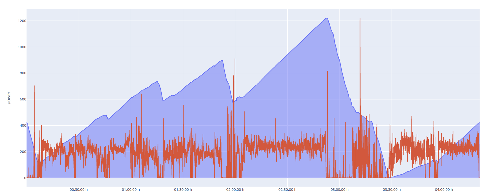

**canape** - **C**ycle **ANA**lyzer of **PE**rformance :bicyclist:
================

`canape` is a lightweight software to read, process, and analyze `.gpx`
data from [Strava](https://strava.com). The `Ride` class allows to read
a file and converts it to a `pandas` data frame.

### Import data

Importing the `Ride` class allows to read from Strave `*.gpx` files:

``` python
from canape import Ride

ride = Ride("data/After_Riccione.gpx")
ride.data[['ele', 'time', 'power', 'lon', 'lat', 'speed']].head()
```

    |████████████████████████████████████████| 15659/15659 [100%] in 10.5s (1487.09/s) 

<div>
<style scoped>
    .dataframe tbody tr th:only-of-type {
        vertical-align: middle;
    }

    .dataframe tbody tr th {
        vertical-align: top;
    }

    .dataframe thead th {
        text-align: right;
    }
</style>
<table border="1" class="dataframe">
  <thead>
    <tr style="text-align: right;">
      <th></th>
      <th>ele</th>
      <th>time</th>
      <th>power</th>
      <th>lon</th>
      <th>lat</th>
      <th>speed</th>
    </tr>
  </thead>
  <tbody>
    <tr>
      <th>0</th>
      <td>847.0</td>
      <td>2023-04-08T08:12:38Z</td>
      <td>None</td>
      <td>11.518783</td>
      <td>46.601212</td>
      <td>NaN</td>
    </tr>
    <tr>
      <th>1</th>
      <td>846.6</td>
      <td>2023-04-08T08:12:39Z</td>
      <td>None</td>
      <td>11.518810</td>
      <td>46.601257</td>
      <td>19.484201</td>
    </tr>
    <tr>
      <th>2</th>
      <td>846.2</td>
      <td>2023-04-08T08:12:40Z</td>
      <td>None</td>
      <td>11.518839</td>
      <td>46.601307</td>
      <td>21.545786</td>
    </tr>
    <tr>
      <th>3</th>
      <td>845.6</td>
      <td>2023-04-08T08:12:41Z</td>
      <td>0</td>
      <td>11.518862</td>
      <td>46.601372</td>
      <td>26.777532</td>
    </tr>
    <tr>
      <th>4</th>
      <td>845.2</td>
      <td>2023-04-08T08:12:42Z</td>
      <td>0</td>
      <td>11.518880</td>
      <td>46.601433</td>
      <td>24.915203</td>
    </tr>
  </tbody>
</table>
</div>

### Functionality

Helper functions allows to show a summary of relevant statistics like
the normalized power, average speed, or climbed meters:

``` python
ride.summary
```

    {'up': 2669.199999999857,
     'down': -2675.3999999999805,
     'distance': 89.02978956387291,
     'hours_total': 6.621111111111111,
     'hours_active': 4.342222222222222,
     'hours_paused': nan,
     'avg_speed': 20.503278046951284,
     'avg_power': 171.51008258114078,
     'np': 207,
     'vi': 1.2069261286844117}

Setting an FTP automatically calculates further statistics such as the
intensity factor or stress level:

``` python
ride.setFTP(250)
ride.summary
```

    {'up': 2669.199999999857,
     'down': -2675.3999999999805,
     'distance': 89.02978956387291,
     'hours_total': 6.621111111111111,
     'hours_active': 4.342222222222222,
     'hours_paused': nan,
     'avg_speed': 20.503278046951284,
     'avg_power': 171.51008258114078,
     'np': 207,
     'vi': 1.2069261286844117,
     'ftp': 250,
     'if': 0.828,
     'tss': 297.695808}

The same can be done for the body weight in kg:

``` python
ride.setWeight(75)
ride.summary
```

    {'up': 2669.199999999857,
     'down': -2675.3999999999805,
     'distance': 89.02978956387291,
     'hours_total': 6.621111111111111,
     'hours_active': 4.342222222222222,
     'hours_paused': nan,
     'avg_speed': 20.503278046951284,
     'avg_power': 171.51008258114078,
     'np': 207,
     'vi': 1.2069261286844117,
     'ftp': 250,
     'if': 0.828,
     'tss': 297.695808,
     'weight': 75,
     'watt_kg': 2.286801101081877,
     'np_kg': 2.76}

The method `.powerCurve()` yields the maximal power over 1, 3, 5, 10, 30
seconds, 1, 5, 10, 20, 30 minutes, and 1 hour:

``` python
ride.powerCurve()
```

<div>
<style scoped>
    .dataframe tbody tr th:only-of-type {
        vertical-align: middle;
    }

    .dataframe tbody tr th {
        vertical-align: top;
    }

    .dataframe thead th {
        text-align: right;
    }
</style>
<table border="1" class="dataframe">
  <thead>
    <tr style="text-align: right;">
      <th></th>
      <th>seconds</th>
      <th>power</th>
    </tr>
  </thead>
  <tbody>
    <tr>
      <th>0</th>
      <td>1</td>
      <td>1220.000000</td>
    </tr>
    <tr>
      <th>1</th>
      <td>3</td>
      <td>1143.666667</td>
    </tr>
    <tr>
      <th>2</th>
      <td>5</td>
      <td>949.400000</td>
    </tr>
    <tr>
      <th>3</th>
      <td>10</td>
      <td>640.900000</td>
    </tr>
    <tr>
      <th>4</th>
      <td>30</td>
      <td>313.233333</td>
    </tr>
    <tr>
      <th>5</th>
      <td>60</td>
      <td>293.816667</td>
    </tr>
    <tr>
      <th>6</th>
      <td>300</td>
      <td>262.460000</td>
    </tr>
    <tr>
      <th>7</th>
      <td>600</td>
      <td>247.848333</td>
    </tr>
    <tr>
      <th>8</th>
      <td>1200</td>
      <td>244.022500</td>
    </tr>
    <tr>
      <th>9</th>
      <td>1800</td>
      <td>239.569444</td>
    </tr>
    <tr>
      <th>10</th>
      <td>3600</td>
      <td>200.931944</td>
    </tr>
  </tbody>
</table>
</div>

The same principle to obtain maximal values over specific time windows
can be applied for any column with `.rollMax()`:

``` python
ride.rollMax(vname = 'watt_kg')
```

<div>
<style scoped>
    .dataframe tbody tr th:only-of-type {
        vertical-align: middle;
    }

    .dataframe tbody tr th {
        vertical-align: top;
    }

    .dataframe thead th {
        text-align: right;
    }
</style>
<table border="1" class="dataframe">
  <thead>
    <tr style="text-align: right;">
      <th></th>
      <th>seconds</th>
      <th>watt_kg</th>
    </tr>
  </thead>
  <tbody>
    <tr>
      <th>0</th>
      <td>1</td>
      <td>16.266667</td>
    </tr>
    <tr>
      <th>1</th>
      <td>3</td>
      <td>15.248889</td>
    </tr>
    <tr>
      <th>2</th>
      <td>5</td>
      <td>12.658667</td>
    </tr>
    <tr>
      <th>3</th>
      <td>10</td>
      <td>8.545333</td>
    </tr>
    <tr>
      <th>4</th>
      <td>30</td>
      <td>4.176444</td>
    </tr>
    <tr>
      <th>5</th>
      <td>60</td>
      <td>3.917556</td>
    </tr>
    <tr>
      <th>6</th>
      <td>300</td>
      <td>3.499467</td>
    </tr>
    <tr>
      <th>7</th>
      <td>600</td>
      <td>3.304644</td>
    </tr>
    <tr>
      <th>8</th>
      <td>1200</td>
      <td>3.253633</td>
    </tr>
    <tr>
      <th>9</th>
      <td>1800</td>
      <td>3.194259</td>
    </tr>
    <tr>
      <th>10</th>
      <td>3600</td>
      <td>2.679093</td>
    </tr>
  </tbody>
</table>
</div>

Or with a custom array of seconds:

``` python
ride.rollMax(window = [1, 30, 600], vname = 'speed')
```

<div>
<style scoped>
    .dataframe tbody tr th:only-of-type {
        vertical-align: middle;
    }

    .dataframe tbody tr th {
        vertical-align: top;
    }

    .dataframe thead th {
        text-align: right;
    }
</style>
<table border="1" class="dataframe">
  <thead>
    <tr style="text-align: right;">
      <th></th>
      <th>seconds</th>
      <th>speed</th>
    </tr>
  </thead>
  <tbody>
    <tr>
      <th>0</th>
      <td>1</td>
      <td>78.161713</td>
    </tr>
    <tr>
      <th>1</th>
      <td>30</td>
      <td>67.984452</td>
    </tr>
    <tr>
      <th>2</th>
      <td>600</td>
      <td>44.890662</td>
    </tr>
  </tbody>
</table>
</div>

## Plotting is done with plotly as backend:

``` python
ride.plotData('power').show()
ride.plotData('watt_kg').show()
```


